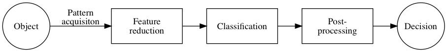
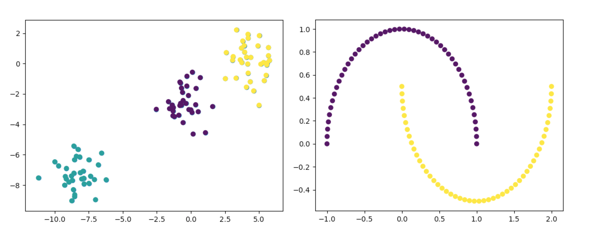
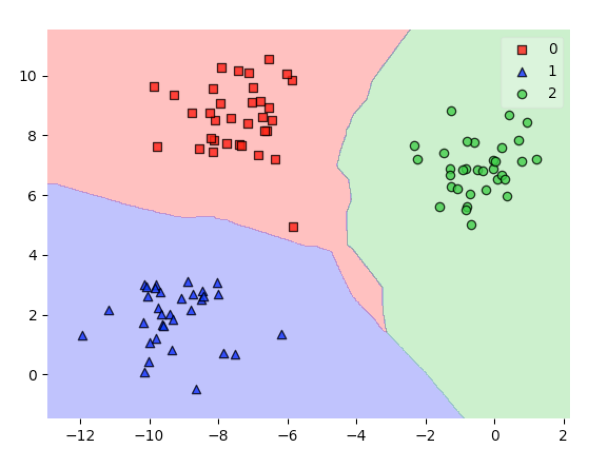

# Module 1. Introduction to Pattern Recognition and scikit-learn
> Before
> - `pip install --user numpy matplotlib sklearn mlxtend`
## Contents
1. General model of pattern recognition task
2. Data sets
4. Generating datasets
5. Data visualization
6. Defining Simple classifier
7. Classifier fitting
8. Visualization of decision boundaries over feature space

#
General model of pattern recognition task

*Pattern Recognition* (PR) is the scientific discipline dealing with methods for object description and classification. In PR task we distinguish three basic concepts: classes, patterns and features.

- **Classes** are states of "nature" or categories of objects associated with concepts or prototypes.
- **Patterns** are "physical" representations of the objects. Often we will refer to patterns as objects or samples.
- **Features** are measurements, attributes derived from the patterns that may be useful for their characterization. The features might be qualitative or quantitative. Discrete features with a large number of possible values are treated as quantitative. In this course we will use discrete features.

Typical PR system has specific functional units as shown below.



- **Pattern acquisition**, which can take severed forms: signal or image acquisition, data collection.
- **Feature extraction and selection**. Features are not all equally relevant. Some of them are important only in relation to others and some might be only “noise” in the particular context. Feature selection and extraction are used to improve the quality of the description.
- **The classification unit** is the kernel unit of the PR system. Use a feature vector provided by previous unit to assign the object to classes.
- **Post-processing**. Sometimes the output obtained from the PR kernel unit cannot be directly used. It may need, for instance, some decoding operation. This, along with other operations that will be needed eventually, is called post-processing.

## Data sets

The central data structure in PRTools is the dataset. It is a matrix in which the rows represent the objects and the columns the features, labels, or other fixed sets of properties (e.g. distances to a fixed set of other objects). The matrix has size m × (k + n) of m row vectors representing the objects, each described by k feature values. One of the columns (from n) can represent the label. Objects with the same label belong to the same class. In addition, a list of prior probabilities is also stored, one per class.


Now we need to enter the python interpreter.

- `python`

```python
#
import numpy as np

# % Define the dataset A with 4 objects given by 3 features.
# The 4 by 3 data matrix is accompanied by a label list of
# 4 labels, connecting each of the objects to one of the two
# classes, 1 and 2. Class labels can be numbers or strings
# and should always be given as rows in the label list.
X = np.array([[1, 2, 1],[1, 2, 3],[2, 3, 4],[2, 2, 1]])
y = [1,1,2,2]
A = (X,y)
```

## Generating datasets


Sets of objects can be generated by one of the data generation routines implemented in PRTools.

- `make_blobs`
- `make_classification`
- `make_gaussian_quantiles`
- `make_circles`
- `make_moons`
- `make_multilabel_classification`

```python
from sklearn import datasets
A = datasets.make_blobs()
B = datasets.make_moons()
```



## Data visualization

For datasets visualization the function `scatter` is supplied. It uses labels as color markers.

```python
import matplotlib.pyplot as pyplot
X, y = A
plt.scatter(X[:,0],X[:,1], c=y)
plt.show()
```

## Defining simple classifier


In sklearn has been implemented many popular classifiers. Look at a [classifier comparison on a sklearn documentation page](http://scikit-learn.org/stable/auto_examples/classification/plot_classifier_comparison.html).

A more detailed description of individual classifiers is contained in laboratories No 2 and 3.

## Classifier fitting

```python
from sklearn import neighbors
clf = neighbors.KNeighborsClassifier(3)
clf.fit(X,y)
clf.predict([2,3,4])
```

## Visualization of decision boundaries over feature space

```python
from mlxtend.plotting import plot_decision_regions
X, y = datasets.make_blobs()
clf = neighbors.KNeighborsClassifier(3)
clf.fit(X,y)
plot_decision_regions(X, y, clf=clf,res=0.02, legend=2)
```



## Exercise 1
> Generate a dataset (using `make_classification`, but reducing number of features to 2), make a scatter-plot, train and plot some classifiers, minimum 3 on one plotting (use subplots).

## Exercise 2
> For the generated moon dataset plot a series of classifiers computed by the k-NN rule for the values of k between 1 on 10. Look at the influence of the neighbourhood size on the classification boundary.
